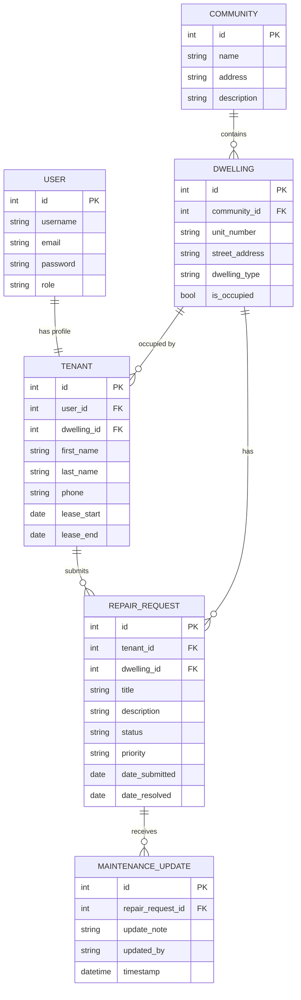

# Entity Relationship Diagram (ERD)

> Updated for Assessment 4 — includes User ↔ Tenant authentication relationship

## Relationships Explained

| Relationship | Type | Description |
|---|---|---|
| User → Tenant | One-to-One | Every tenant has exactly one Django user login account |
| Community → Dwelling | One-to-Many | A community contains multiple dwellings |
| Dwelling → Tenant | One-to-Many | A dwelling can have multiple tenants over time |
| Tenant → RepairRequest | One-to-Many | A tenant can submit many repair requests |
| Dwelling → RepairRequest | One-to-Many | A dwelling can have many repair requests |
| RepairRequest → MaintenanceUpdate | One-to-Many | Each repair request receives multiple status updates |

## Key Change from Assessment 2

The most important new relationship added in Assessment 4 is **User → Tenant (1:1)**.

In Assessment 2, there was no authentication — tenants existed as data only.
In Assessment 4, every Tenant is linked to a Django User account, enabling login and role-based access control.
