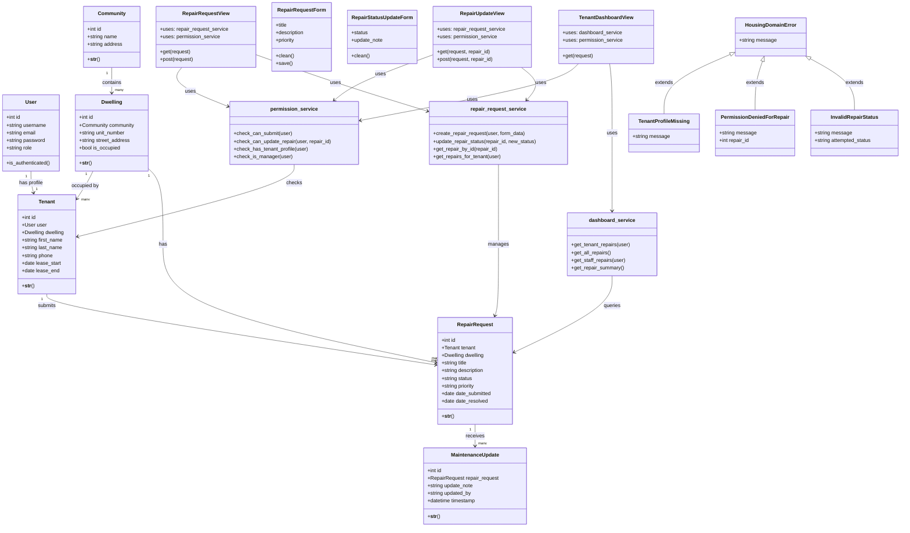

# Class Diagram

> Assessment 4 — includes Models, Services, Exceptions, Forms, and Views

## Class Summary

### Models
| Class | Purpose |
|---|---|
| User | Django auth user — linked to Tenant for login |
| Tenant | Resident profile linked to a User and Dwelling |
| Community | A housing community containing multiple dwellings |
| Dwelling | A single unit within a community |
| RepairRequest | A repair job submitted by a Tenant |
| MaintenanceUpdate | A status update on a RepairRequest |

### Services
| Class | Purpose |
|---|---|
| permission_service | Checks user rights before any action |
| repair_request_service | Handles repair creation and status updates |
| dashboard_service | Fetches data for role-specific dashboards |

### Exceptions
| Class | Purpose |
|---|---|
| HousingDomainError | Base exception for all domain errors |
| TenantProfileMissing | Raised when logged-in user has no Tenant profile |
| PermissionDeniedForRepair | Raised when user tries to access a repair they cannot |
| InvalidRepairStatus | Raised when a status change is not allowed |
