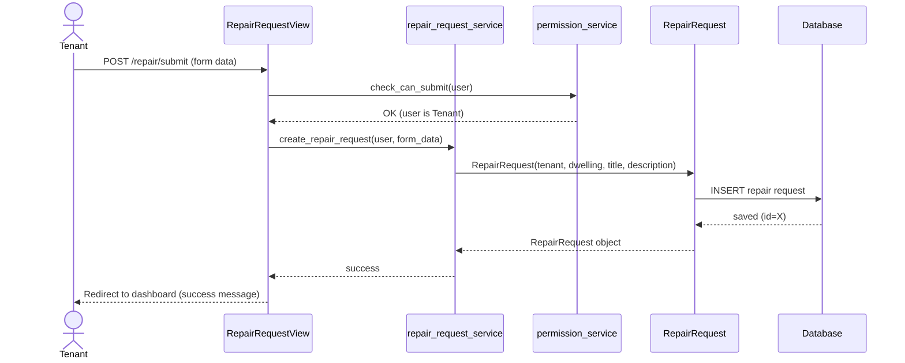
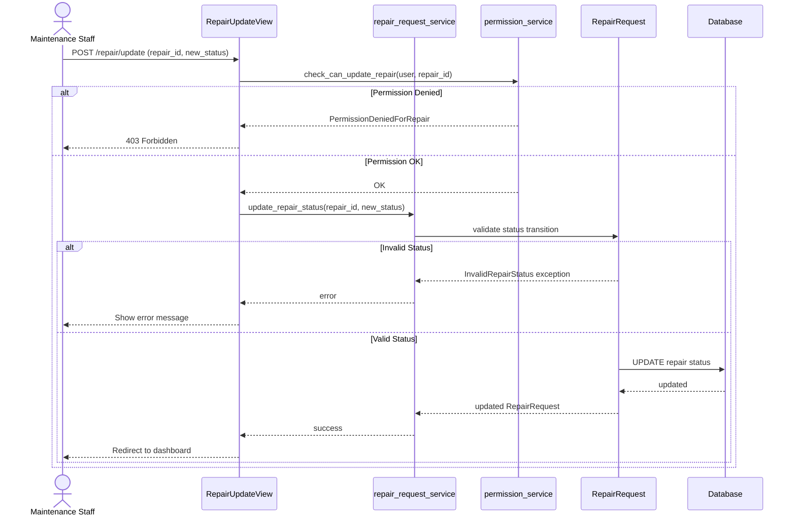
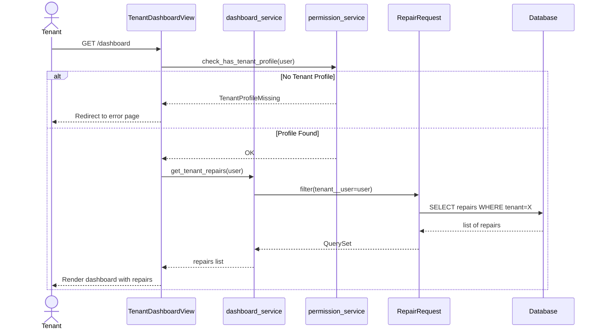

# Sequence Diagrams

> Assessment 4 — shows how requests flow through Views → Services → Models → Database

---

## Diagram 1: Tenant Submits a Repair Request

---

## Diagram 2: Staff Updates Repair Status

---

## Diagram 3: Tenant Views Own Repairs

---

## Summary

| Diagram | What it shows |
|---|---|
| Diagram 1 | How a repair request is created through the service layer |
| Diagram 2 | How permission and status validation work during an update |
| Diagram 3 | How a tenant's dashboard loads with permission checking |

All three diagrams follow the same pattern:
**User → View → Service → Model → Database**

This confirms the service layer architecture separates HTTP logic (views) from business logic (services).
